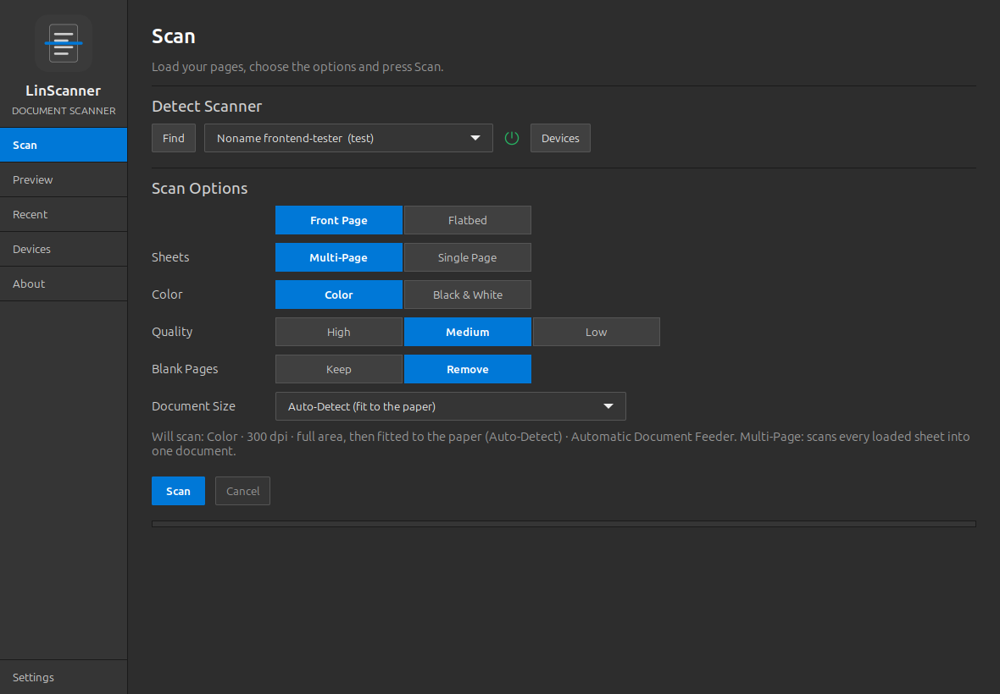
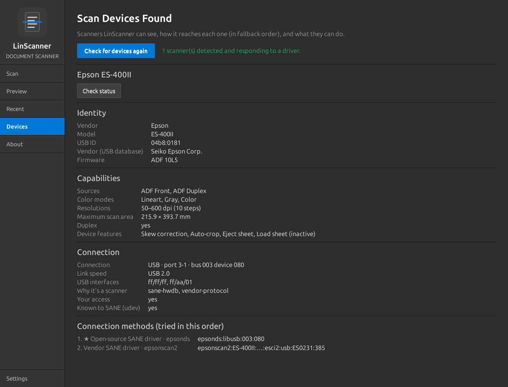
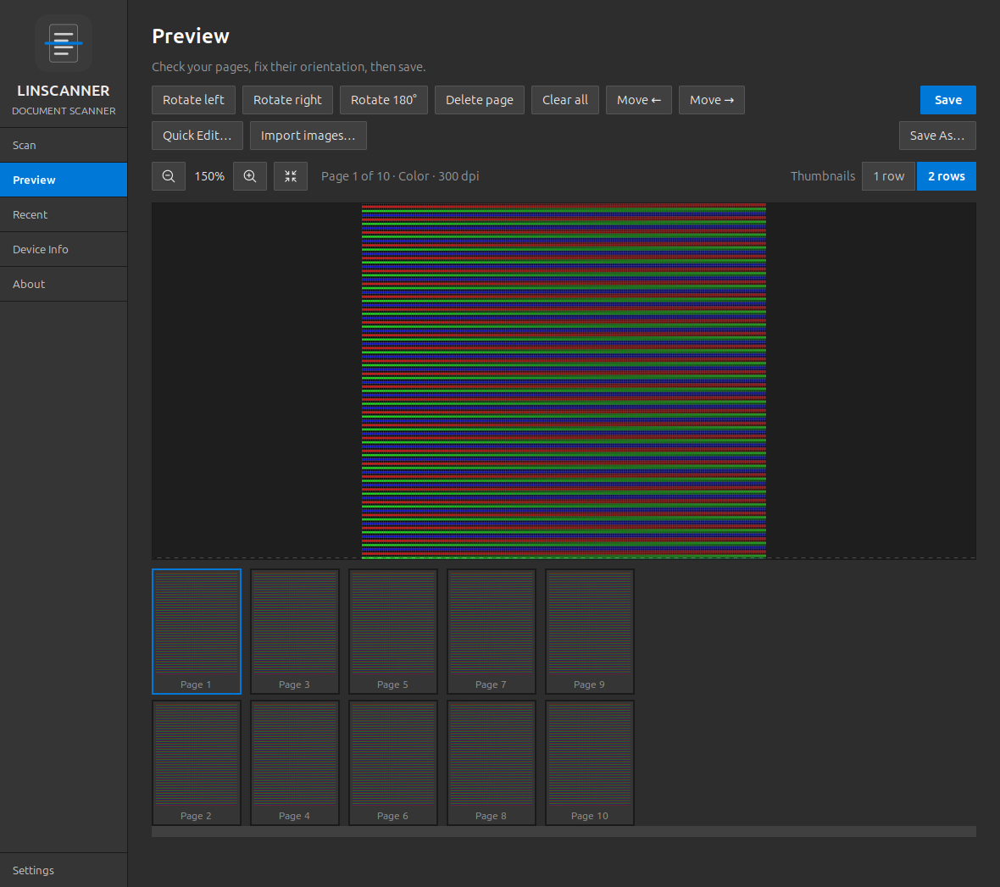
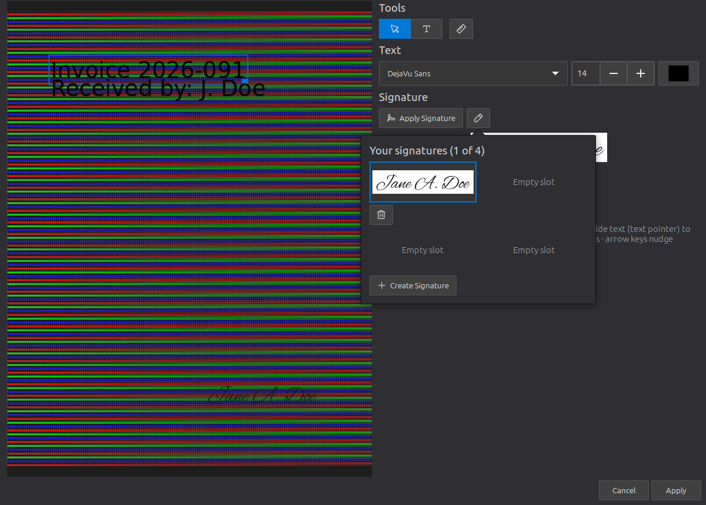
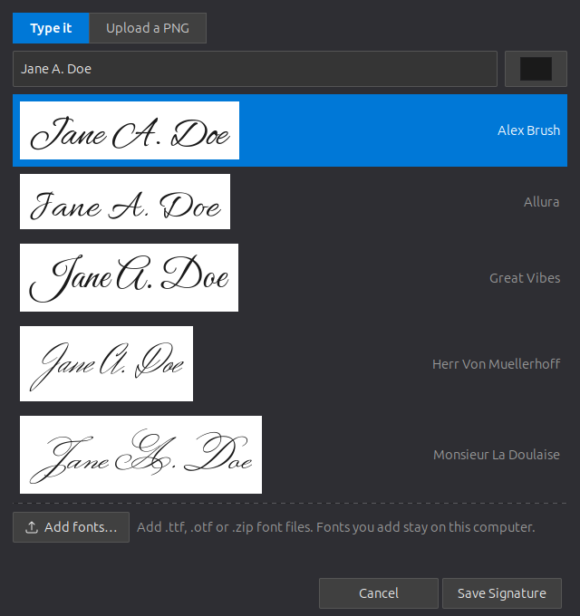
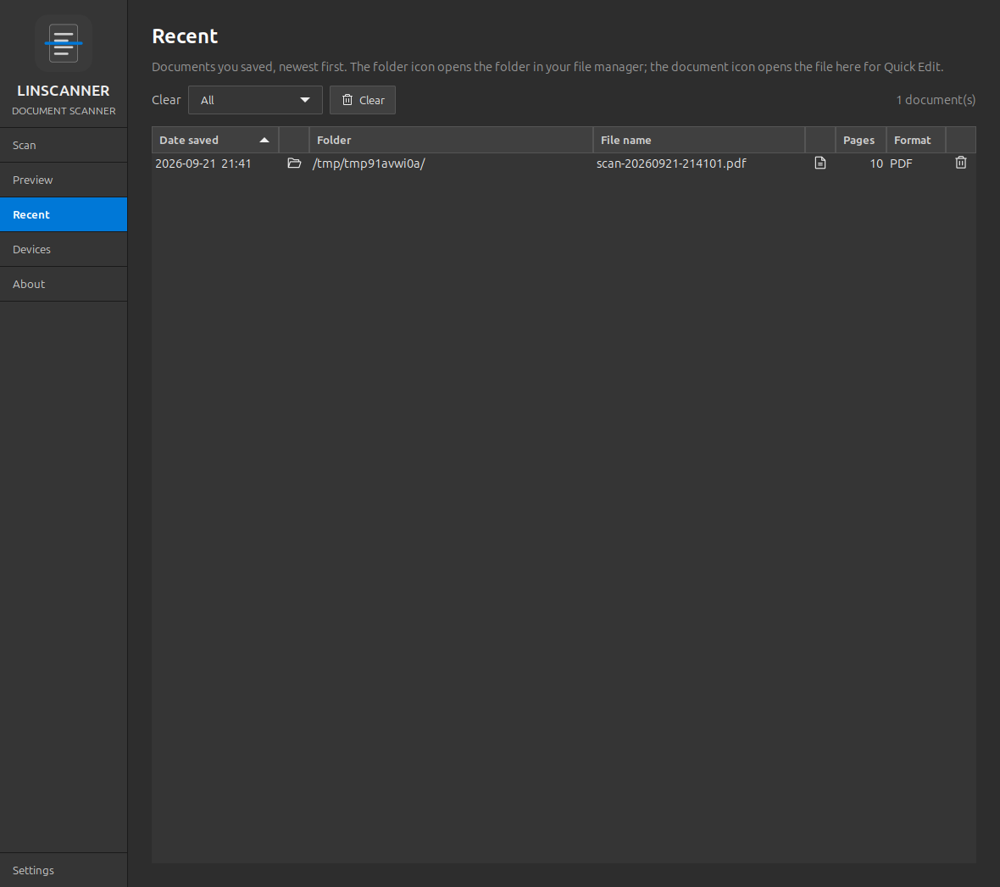

# LinScanner

**A universal document scanner for Linux.** Scan in **Color** or **Black &
White** at **High, Medium or Low** quality, check the pages in a preview,
rotate or remove pages, then **Save As** PDF, PNG, JPEG or TIFF. It works
with any **cable-connected (USB)** scanner or multifunction printer that
Linux's standard scanning system (SANE) can drive.

> **Supported connection:** LinScanner currently supports scanners
> **connected by cable (USB) only**. Scanning over **Wi-Fi or a network
> (Ethernet) connection is not supported at this time.**

| | |
|---|---|
| Version | 0.3.5 (see [`VERSION`](VERSION), [`changelog.md`](changelog.md)) |
| Platform | Linux desktop, GTK 3 |
| Tested on | Linux Mint 22.3 (Ubuntu 24.04 base), kernel 7.0, amd64, with an Epson WorkForce ES-400 II |
| Repository | [MensuraMedia/linscanner](https://github.com/MensuraMedia/linscanner); also part of [linux-peripherals](https://github.com/MensuraMedia/linux-peripherals) (offline installers, device references) |
| Connection | USB cable only (Wi-Fi / network scanning not supported at this time) |
| License | [LinScanner Community License (Noncommercial)](LICENSE): free to use, copy, modify and share; commercial use by permission |



---

## Contents

1. [Features](#1-features)
2. [Compatibility](#2-compatibility)
3. [Installation](#3-installation)
4. [Using LinScanner](#4-using-linscanner)
5. [Settings, files and command line](#5-settings-files-and-command-line)
6. [Troubleshooting](#6-troubleshooting)
7. [Safety, security and privacy](#7-safety-security-and-privacy)
8. [Themes and appearance](#8-themes-and-appearance)
9. [Known limits and roadmap](#9-known-limits-and-roadmap)
10. [Development](#10-development)
11. [Credits](#11-credits)
12. [License](#12-license)

---

## 1. Features

| Area | What you get |
|---|---|
| **Scanning** | Any cable-connected (USB) SANE scanner, plus LinScanner's own driverless eSCL client. **Scan Type**: *Front Page* or *Front & Back* (and *Flatbed* on scanners with both) |
| **Remembers your scanner** | Reached directly at the next start (a second or two instead of a full search); a spinner while looking, then a green power icon when it's ready, or a red one with "Device may be off. Check power settings."; and plain words when something needs fixing ("Unable to detect scanner. Check that it's connected and powered on") |
| **Sheet-fed modes** | **Multi-Page** (the whole stack as one document) or **Single Page** (the whole stack, each sheet its own document: view each in Preview, **Save** one or **Save All**) |
| **Connection fallback** | Tries every way to reach the scanner in order over the USB cable (open-source driver → vendor driver → driverless IPP-over-USB → own eSCL client), until one scans. Never retries when you need to act (feeder empty, jam, cover open) |
| **Scan Devices Found** (sidebar: **Devices**) | Every detected scanner with identity, USB connection details, connection methods, permissions, capabilities, live status and firmware, plus **Check for devices again** |
| **Color / Black & White** | Color, or Black & White. B&W is grayscale by default (keeps faint text); Settings can switch it to pure black-and-white |
| **Quality** | High 600 dpi, Medium 300 dpi, Low 150 dpi, automatically matched to the nearest resolution your scanner supports |
| **Document Size** | **Auto-Detect** (fits each page to the paper, when its edges can be seen); documents (Letter, Legal, Executive, Half Letter, A4, A5, A6, B5); receipts (80 / 58 mm); cards (business, ID / credit, index); photos (4×6, 5×7); checks; full scan area |
| **Clear feedback** | A summary line shows exactly what will be scanned; per-page progress; page count; plain-language errors (feeder empty, paper jam, scanner busy, not responding) |
| **Cancel** | Stops the scan and keeps the pages already scanned |
| **Preview** | Fast page switching; **zoom up to 16×** (buttons, Ctrl + wheel, drag to pan), right into the grain of a scan; a scrollable, left-aligned thumbnail strip with **1 or 2 rows**; opens automatically after scanning |
| **Page tools** | A PDF-editor style toolbar of icons with captions on hover: undo / redo; add pages from a PDF or images, duplicate, extract a page, delete, clear; rotate, move, reverse order; add text, signature; page navigation, zoom, fit page, fit width |
| **Window** | Resizable, and small enough to snap to half or a quarter of the screen (the pages scroll when needed); its own icon in the panel and Alt+Tab |
| **Blank Pages** | *Keep* or *Remove* right on the Scan page (the same switch as the Blank-page removal module) |
| **Quick Edit** | **Add Text**: click anywhere on the page and type, with alignment guides that line text up with earlier text. **Apply Signature** places your signature; the edit icon beside it chooses or creates one (up to 4 saved, typed in one of 9 signature fonts or uploaded as a PNG). Hand pointer to move, text pointer to edit, corner to resize. Non-destructive until you save |
| **Recent** | A table of saved documents (date, folder, file name), newest first: the folder icon opens the file manager, the document icon opens the file for Quick Edit, the trash icon removes the entry; clear all or entries older than 5–90 days |
| **Automatic clean-up** | Auto-crop (feeder overrun), deskew and blank-page removal, on by default |
| **More modules** | Searchable PDF (OCR), auto-rotate, image enhancement, scan profiles, auto-save with file-name templates, batch splitting, PDF/A and smaller PDFs, import images. Each can be switched on or off in Settings |
| **Save / Save As** | **Save** writes to the document's file (a new document goes to your Save folder as a PDF). **Save As** chooses the name and format: PDF (all pages in one file), TIFF (multi-page), PNG or JPEG (one file per page) |
| **Smart driver choice** | One scanner offered by several drivers is shown once, with the most reliable driver first and the others kept as fallbacks |
| **Remembers your choices** | Scanner, Scan Type, color, quality, paper, thumbnail rows, signature, save folder and theme |
| **Look** | Flat, square gtk-python-dashboard-starter layout; the framework's seven themes, **Default Blue** by default |
| **Works offline** | Every dependency is in the repo's offline package pool |
| **Try without hardware** | `--test-scanner` uses SANE's built-in virtual scanner |

The complete feature and function list is in
[`docs/FEATURES.md`](docs/FEATURES.md). How it works (USB processes, connection
methods, fallback, modules) is in [`docs/TECHNICAL.md`](docs/TECHNICAL.md), and
every code function is in [`docs/api-reference.md`](docs/api-reference.md).

---

## 2. Compatibility

### Operating systems

| System | Status |
|---|---|
| **Linux Mint 22.x** / Ubuntu 24.04 (amd64) | **Tested.** Offline install supported |
| Ubuntu 22.04, Linux Mint 21, Debian 12/13 | Expected to work (needs Python 3.10+, GTK 3, SANE); installs from the internet, since there's no offline bundle for these yet |
| Other distributions (Fedora, Arch, openSUSE, …) | Should run from `run.sh` with the equivalent packages; `install.sh` is Debian-family only |
| arm64 (Raspberry Pi 64-bit etc.) | Should work with distro packages (untested) (?) |
| Desktop sessions | Any X11 or Wayland desktop that runs GTK 3 apps (Cinnamon, GNOME, MATE, Xfce, KDE, …) |

### Scanners

LinScanner uses **SANE**, so it supports every **cable-connected (USB)**
scanner that has a SANE driver on your system.

> **Wi-Fi and network scanning is not supported at this time.** Please
> connect your scanner with a USB cable. Many Wi-Fi models also have a USB
> port and work well that way. LinScanner doesn't search the network, so
> network scanners aren't listed. The option appears in Settings as
> **Not Supported**. Network support may be added in a future version.


| Scanner type | How Linux talks to it | Driver (package) |
|---|---|---|
| **USB multifunction printers with IPP-over-USB** | Driverless over USB via the `ipp-usb` service | `airscan` + **ipp-usb** |
| **Epson** ES / DS / WF / Perfection series | USB | `epsonds`, `epson2` (libsane1); optional Epson `epsonscan2` |
| **HP** scanners and all-in-ones | USB | `hpaio` (**libsane-hpaio** / hplip) |
| **Canon** PIXMA / LiDE / imageFORMULA | USB | `pixma`, `genesys`, `canon_dr` (libsane1) |
| **Brother** | USB | driverless over IPP-over-USB (`airscan`) for most; Brother's `brscan` for older models |
| **Fujitsu / Ricoh** fi-series, ScanSnap | USB | `fujitsu`, `epjitsu` (some need a firmware file) |
| **Plustek, Avision, Kodak, Panasonic, Visioneer, Xerox, Samsung, …** | USB | `plustek`, `avision`, `kodak*`, `kvs*`, `xerox_mfp`, … (80+ drivers in libsane1) |
| Network / Wi-Fi scanners, and scanners shared from another computer (`saned`) | **Not supported at this time** | — |

**Verified hardware:** Epson WorkForce ES-400 II (USB `04b8:0181`, driver
`epsonds`). The initial hardware test passed on 2026-09-21.



**Check your scanner** before or after installing:
```bash
scanimage -L                                 # lists every scanner SANE can use
sane-find-scanner -q                         # "found possible USB scanner" = recognised on USB
../bin/device-finder --scanners              # full inventory, marks scanners and their driver
```
If `scanimage -L` lists your scanner, LinScanner can use it. If not, see
[Troubleshooting](#6-troubleshooting). For the full research on every
connection method, see
[`docs/research/connection-methods.md`](docs/research/connection-methods.md).

### Requirements

- Python 3.10+
- GTK 3.24 with PyGObject (`python3-gi`, `python3-gi-cairo`, `gir1.2-gtk-3.0`)
- Pillow (`python3-pil`)
- SANE (`sane-utils`, `libsane1`), plus `sane-airscan` for IPP-over-USB multifunction printers

No pip packages and no internet at runtime.

---

## 3. Installation

LinScanner has its own repository,
[MensuraMedia/linscanner](https://github.com/MensuraMedia/linscanner). It is
also included in
[linux-peripherals](https://github.com/MensuraMedia/linux-peripherals) (as a
git submodule), which adds an offline package pool and device references.

### Recommended (as your normal user, not sudo)
```bash
git clone https://github.com/MensuraMedia/linscanner.git
bash linscanner/install.sh
```
It installs any missing distro packages (with `apt`), asks for your password
only if packages are missing, adds **LinScanner** to your applications menu
and checks that the app starts and that SANE sees scanners. It's safe to run
again.

**Inside linux-peripherals** (works offline on Mint 22 / Ubuntu 24.04):
```bash
git clone --recurse-submodules https://github.com/MensuraMedia/linux-peripherals.git
cd linux-peripherals
bash linscanner/install.sh
```
There, missing packages come **from the offline pool first**, so no internet
is needed. It asks for your password only if packages are missing. It then adds **LinScanner** to your
applications menu and checks that the app starts and that SANE sees scanners.
It's safe to run again.

### Offline machine
Clone the repo with Git LFS on any connected machine (`git lfs pull`), copy
it over (for example on a USB stick), then run the installer as above.
Details: [`../offline/README.md`](https://github.com/MensuraMedia/linux-peripherals/blob/main/offline/README.md).

### Manual
```bash
sudo apt install python3-gi python3-gi-cairo gir1.2-gtk-3.0 python3-pil sane-utils libsane1 sane-airscan
linscanner/run.sh
```

### Uninstall
```bash
bash linscanner/install.sh --uninstall     # removes the menu entry
rm -rf ~/.config/linscanner                # removes your settings (optional)
```

---

## 4. Using LinScanner

### Scan a document
1. Open **LinScanner** from the menu (or run `linscanner/run.sh`). You can also **right-click a PDF or
   image in your file manager and choose Open With → LinScanner**: its pages open in Preview, ready to
   rotate, edit, sign and save.
2. **Scanner:** it's found automatically. Finding scanners takes about 10
   seconds; press **Find** (before the scanner list, under **Detect Scanner**) after plugging one in.
   A spinner turns while it looks. A **green power icon** after the
   scanner's name means it's ready, and LinScanner remembers it for next time.
   A **red power icon** with "Device may be off. Check power settings." means
   it can't be found: switch it on or check the cable, then press **Find**.
3. **Scan Options:** the first row is the scan type. *Front Page* scans one
   side of each sheet; *Front & Back* scans both sides (shown when your
   scanner can). Scanners with a glass too also offer *Flatbed*.
   - **Sheets** (feeder): *Multi-Page* scans the whole stack into one
     document. *Single Page* also scans every sheet in the tray (document
     feeders pull the whole stack through once a scan starts), but each sheet
     becomes **its own document**; with *Front & Back*, a sheet's two sides
     stay together.
     - In Preview the thumbnails are labelled *Doc 1, Doc 2, …* (✓ once
       saved). **Save** saves the selected document, and **Save All** saves
       every document as its own PDF in your default save location.
     - Once everything is saved, the next Scan starts afresh. Unsaved pages
       are never thrown away.
4. **Color:** *Color* or *Black & White*.
5. **Quality:** *High* for small print, photos or archiving; *Medium* for
   everyday documents; *Low* for quick copies and small files.
6. **Document Size:** **Auto-Detect** (the default) fits each page to the paper
   you scanned: receipts, cards and letters alike. Or choose a size: documents,
   receipts (80 / 58 mm wide), cards, photos or checks. Auto-Detect needs the
   paper to look different from the scanner's background; when it doesn't,
   the page is kept whole (or the chosen card / receipt size is used).
7. Check the grey **"Will scan: …"** line, then press **Scan**.

Pages appear as they are scanned, and **Preview** opens when the scan finishes.









### Fix and save
The toolbar works like a PDF editor's. Every tool is an icon; hover over one
to see its name. The tools are grouped from left to right:

| Group | Tools |
|---|---|
| **History** | **Undo** (Ctrl+Z), **Redo** (Ctrl+Shift+Z / Ctrl+Y). Every change to the pages can be undone until you close LinScanner |
| **Pages** | **Add Page** (insert the pages of a PDF, or images, after the current page) · **Add Image** (add image files as new pages) · **Duplicate page** · **Save this page as…** (extract one page to its own file) · **Delete page** · **Clear all** |
| **Arrange** | **Rotate left / right / 180°** · **Move page left / right** · **Reverse page order** (for a stack fed last page first) |
| **Content** | **Add Text** (T icon) · **Signature** |
| View bar | **First / Previous / Next / Last page** (Home, Page Up, Page Down, End) · **Zoom out / in** (Ctrl − / +, Ctrl + wheel) · **Fit page** (Ctrl 0) · **Fit width** · thumbnails in **1 row** or **2 rows** |

- Click a thumbnail to view that page. The strip scrolls sideways. Drag a
  zoomed page to move around.
- **Add Text** and **Signature** open the page editor:
  - **Add Text** (T icon): the pointer becomes a text cursor. Click
    anywhere on the page and type. Enter starts a new line underneath, Esc
    finishes.
  - **Change the font, size or colour** the way you would in a word
    processor. Click inside the text, highlight the words (drag across them,
    Shift + arrows, double-click a word, or Ctrl+A for all), then choose the
    font (20 basic fonts plus the signature fonts), size or colour. Only the
    highlighted words change; with nothing highlighted, the whole text
    changes. Text has no resize handle: its size is set in the panel.
  - **Alignment guides:** while you place or move text, dotted lines appear
    when it lines up with earlier text (same edge, centre, equal spacing, or
    mirror image across the page). It snaps gently and never locks. Hold
    **Alt** to place freely, or switch the guides off with the viewfinder icon.
  - **Apply Signature:** click it, then click where your signature goes. Drag
    its corner square to resize it (only signatures have one).
  - **Edit icon** (next to Apply Signature): choose one of your saved
    signatures (up to 4, kept between sessions), delete one with its trash
    icon, or **Create Signature**. Type your name and pick one of the two
    signature fonts (Great Vibes or Sacramento, or fonts you add yourself), or upload a PNG (a white background can be made
    transparent).
  - **Pointer:** a hand on an item's frame means drag to move; a text cursor
    inside text means click to edit or highlight; a diagonal arrow on a
    signature's corner square means resize. The trash icon deletes the selected item, and the stack
    icon applies it to every page.
  - Edits show in the preview and are added to the file when you save.
- **Import images…** adds PNG/JPEG/TIFF files as pages (e.g. scans your
  scanner saved to a USB stick).
- **Save** (above Save As) writes to the document's file: the one you last
  saved, or the one you opened from Recent. A new document is saved as a PDF
  in your Save folder with an automatic name.
- **Save As…** asks for a file name and format:

| Format | Best for | Pages |
|---|---|---|
| **PDF** | Sharing, printing, archiving | All pages in one file |
| **TIFF** | Archiving at full quality | All pages in one file |
| **PNG** | Lossless images, text | One file per page (`name-001.png`, …) |
| **JPEG** | Small photo-like images | One file per page |

### Quality and file size (Letter page, typical)

| Quality | dpi | Use |
|---|---|---|
| High | 600 | Fine print, photos, archiving (largest files) |
| Medium | 300 | Everyday documents; the standard for OCR and PDFs |
| Low | 150 | Quick copies, email, screen reading |

---

## 5. Settings, files and command line

**Settings page:**

| Setting | Effect |
|---|---|
| Color scheme | The framework's seven themes (Default Blue by default) |
| Black & White | Grayscale (default) or Pure black & white |
| Default save location | Where **Save** puts new documents and **Save As** starts (**Choose…**); saving somewhere else doesn't change it |
| Features | Switch each module on or off, with its options (blank-page sensitivity, enhancement sliders, PDF/A and size, auto-save folder and name template) |
| Network scanning (Wi-Fi / Ethernet) | Shown greyed out and marked **Not Supported**. Only USB-connected scanners are supported at this time, and LinScanner doesn't search the network |
| Drivers | Show every driver per scanner, and SANE's virtual test scanner (off by default) |

**Files:**

| Path | Content |
|---|---|
| `~/.config/linscanner/settings.json` | Your settings (including feature on/off and options) |
| `~/.local/share/linscanner/signatures/` | Your saved signatures (up to 4) |
| `~/.local/share/linscanner/fonts/` | Signature fonts you added (kept on this computer) |
| `~/.local/share/linscanner/recent.json` | The Recent list (paths, dates, page counts) |
| `~/.local/state/linscanner/logs/` | Daily logs (14 days), redacted |
| `/tmp/linscanner-*/` | This session's scans (deleted when you close LinScanner, so save first) |
| `~/.local/share/applications/linscanner.desktop` | Menu entry |

**Command line:**

| Command | Effect |
|---|---|
| `run.sh` | Start LinScanner |
| `run.sh --test-scanner` | Use only SANE's virtual scanner, with separate throwaway settings (no hardware needed) |
| `run.sh --page devices` | Open on a page: `scan`, `preview`, `devices`, `settings`, `about` |
| `run.sh FILE…` | Open PDFs or images as pages in Preview (what **Open with LinScanner** in the file manager does) |
| `run.sh --version` | Show the version |
| `run.sh --quit-after N` | Close after N seconds (automated tests) |
| `run.sh --debug` | Verbose log (also printed to the terminal) plus SANE driver-loading details |

---

## 6. Troubleshooting

**Logs:** LinScanner keeps a log of every session in
`~/.local/state/linscanner/logs/` (one file per day, kept 14 days).
It records:
- detection: scanners, connection methods, timing;
- every scan: your choices, the exact scanner command, each page, and what
  auto-crop, deskew and blank removal did to it;
- fallback attempts, and errors with the scanner's full message;
- every save.

Serial numbers and your home folder path are removed. **Settings →
Diagnostics** has **Open log folder** and **Save diagnostics…** (one zip to
send for help). Start with `run.sh --debug` for extra detail.


| Problem | What to do |
|---|---|
| "No scanners found" | Check the cable and power, then **Devices → Check for devices again**. A scanner found on USB but with no working driver is listed there with what to do |
| Scanner listed but "not responding" / timed out | Power-cycle the scanner and press **Find**. On the ES-400 II this happens after the Epson Scan 2 Flatpak crashes |
| "Document feeder is empty" | Load pages **face down**, top edge first, until the feeder grips them |
| "Scanner is busy" | Close other scanning apps (Document Scanner, Epson Scan 2, gscan2pdf) |
| Pages come out upside down | Turn on **Auto-rotate** in Settings → Features (needs text on the page), or use **Rotate 180°** |
| Image is longer than the page | Auto-crop (on by default) trims the feeder overrun when it's distinguishable from the paper; otherwise choose the matching **Paper size** |
| A page with content was removed as blank | Lower the blank-page sensitivity in Settings → Features, or turn blank-page removal off |
| Can't find the text in a saved PDF | Turn on **Searchable PDF (OCR)** in Settings → Features |
| Scanning is slow at High quality | Use a USB 3 port and cable if the scanner supports it (`../bin/device-finder` shows the link speed) |
| Scanner appears twice in other apps | A vendor driver (e.g. Epson's `epsonscan2`) adds a second entry; LinScanner hides it automatically |
| Only works with sudo | Permissions: log out and in, or re-run the device installer (for the ES-400 II: `devices/scanner/epson-es-400-ii/install.sh`) |
| "Unable to detect scanner" | Check the USB cable and that the scanner is switched on (many turn themselves off after a while), then press **Find** |
| Auto-Detect didn't trim the page | The paper looks the same as the scanner's background (for example white paper on a white backing), so its edges can't be found. Choose the matching paper size instead |
| A remembered scanner isn't found at start | LinScanner searches for scanners automatically when the remembered one doesn't answer (for example after plugging it into another port) |
| My Wi-Fi / network scanner isn't listed | Wi-Fi and network scanning isn't supported at this time, so LinScanner doesn't search the network. Connect the scanner with a USB cable |

**Scanner-specific notes** are in the device references, e.g.
[`../devices/scanner/epson-es-400-ii/README.md`](https://github.com/MensuraMedia/linux-peripherals/blob/main/devices/scanner/epson-es-400-ii/README.md).

---

## 7. Safety, security and privacy

### Our commitment

**Your scans and information never leave your computer.** LinScanner does not
send documents, scan images, text, signatures, settings, logs, device details
or any other data to anyone else. That includes the LinScanner developers,
cloud services, analytics or advertising companies, AI or OCR services, and
any other second or third party.

- **No cloud.** Every step runs on the computer that did the scan: scanning,
  page processing, OCR, PDF creation, Quick Edit and saving.
- **No accounts, sign-in, telemetry, analytics, crash reporting, ads or
  update checks.** LinScanner never contacts the internet.
- **OCR is local.** Searchable PDFs use Tesseract, installed on your
  computer. Your text is never uploaded for recognition.
- **You decide what leaves.** A file leaves your computer only if you copy,
  email or upload it yourself.

### Where your data is kept

| Data | Location | Lifetime |
|---|---|---|
| Scans in progress | `/tmp/linscanner-*/`, a folder only your user can read | Deleted when LinScanner closes |
| Saved documents | The folder you choose in **Save As** or Auto-save | Until you delete them |
| Settings and profiles | `~/.config/linscanner/settings.json` | Until you delete them |
| Signatures | `~/.local/share/linscanner/signatures/` | Until you delete them (Quick Edit → edit icon → trash) |
| Fonts you added | `~/.local/share/linscanner/fonts/` | Until you delete them |
| Recent list | `~/.local/share/linscanner/recent.json` (paths and dates only) | Until you clear it (Recent → Clear) |
| Logs | `~/.local/state/linscanner/logs/` | 14 days, then deleted automatically |

- **Logs don't contain your content.** They record technical events only: no
  page images and no Quick Edit text.
  - Scanner serial numbers are replaced with `…`.
  - Your home folder path is shown as `~`.
- **Settings → Diagnostics → Save diagnostics…** writes a zip file to the
  place you pick on this computer. It is never sent anywhere automatically;
  sharing it (for example, to get help) is your choice. It contains the same
  redacted logs and system details, and no scans.

### LinScanner doesn't use your network

LinScanner doesn't search your network for scanners, doesn't send anything
onto it, and never contacts the internet.

- **Network discovery is switched off.** LinScanner gives the scanner drivers
  its own private copy of the SANE settings, with every network search turned
  off:
  - mDNS / Bonjour, WS-Discovery;
  - Epson, Canon, Kodak, Konica Minolta and Dell network broadcasts;
  - SNMP;
  - remote `saned`.

  Your system's SANE configuration isn't changed, and other scanning apps are
  unaffected.
- **USB only.** Scanned pages travel only along the USB cable, from the
  scanner into your computer.
- **IPP-over-USB multifunction printers** are reached at `127.0.0.1`, ports
  60000–60015. That address is *this computer*: the `ipp-usb` service passes
  the traffic down the USB cable, and it never reaches a network.
- **Network scanning** (Wi-Fi / Ethernet) is listed in Settings, greyed out
  and marked **Not Supported**.

**Verified on 2026-09-21 with `strace`:** device discovery and reading the
scanner's settings (Epson ES-400 II, both drivers). Every network connection
went to this computer (`127.0.0.1`). None went to your local network, and
none to the internet.

### Security

- **No elevated rights.** LinScanner runs as your normal user and never asks
  for administrator access. Access to USB scanners comes from standard
  desktop permissions (udev `uaccess`).
- **The installer** asks for your password only to install missing distro
  packages. It takes them from the repository's offline package pool first,
  and only falls back to your system's configured Debian/Ubuntu/Mint
  package sources if that pool isn't available.
- **Trusted components only.** LinScanner uses Python, GTK and the
  distribution's SANE, Tesseract and Ghostscript packages, plus Epson's own
  driver for Epson scanners. No code is downloaded at run time.
- **Private temporary files.** Scans in progress are kept in a folder only
  your user can open, and are removed on exit.

## 8. Themes and appearance

LinScanner's structure comes from **gtk-python-dashboard-starter**, and so
do its seven dark themes:

| Theme | Accent |
|---|---|
| **Default Blue** (default) | `#0078D7` on `#2d2d2d` / `#353535`, as in the framework's example image |
| Adapta | `#00bcd4` |
| Materia | `#8ab4f8` |
| Dracula | `#bd93f9` |
| Nord | `#88c0d0` |
| Gruvbox | `#fe8019` |
| Monokai | `#f92672` |

**Theme history (so older notes make sense):**
- Version 0.1.0 first shipped a "Black Yellow Gray" default (from a
  universal-instruction-set reference image).
- The default then briefly became Nord.
- On 2026-09-21 the user corrected this. The default is the **framework's
  Default Blue**, and Black Yellow Gray was **removed**.
- If your saved settings name a removed theme, LinScanner falls back to
  Default Blue.
- Older commits and the append-only change log still mention the earlier
  defaults.

**Styling:** since 0.2.0 LinScanner uses the framework's flat, square layout (full-width sidebar rows, active row filled with the accent colour, flat buttons).

---

## 9. Known limits and roadmap

**Current limits:**
- Only cable-connected (USB) scanners are supported. Wi-Fi and network scanning is not supported at this time.
- Finding scanners takes about 10–20 seconds, because SANE checks every driver, and all of them are checked over USB.
- Cameras (PTP) and document cameras are detected and explained, but not captured.
- Settings stored inside the scanner (sleep timer, etc.) can't be changed from Linux.
- OCR is English only.

**Done in 0.3.4:**
- Single Page scans the whole tray, with each sheet as its own document (Doc labels, per-document Save, Save All). Stopping after one page skipped the remaining sheets on the ES-400 II.

**Done in 0.3.3:**
- a power icon for the scanner (green: ready; red: "Device may be off. Check power settings.");
- **Scan Options**, **Multi-Page / Single Page** (one page, then save);
- Quick Edit text styled like a word processor (highlight words, then change the font, size or colour; resizing is for signatures only);
- two signature fonts;
- **Default save location** in Settings;
- font credits moved from About to the backlog.

**Done in 0.3.2:**
- the PDF-editor style Preview toolbar (Add Page, Add Image, Add Text, Signature, duplicate, extract, reverse, undo / redo, page navigation, fit width);
- the window resizes and snaps to half or a quarter of the screen.

**Done in 0.3.1:**
- Phosphor Icons;
- icon page tools with hover captions;
- Detect Scanner / Find / check mark;
- uniform Options with Blank Pages;
- Document Size;
- Devices;
- the app icon in Alt+Tab and the panel;
- 10 pt button text;
- signature fonts limited to licence-checked ones.

See [`docs/design/0.3.1-ui-polish.md`](docs/design/0.3.1-ui-polish.md).

**Done in 0.3.0:**
- faster Preview with zoom and 1- or 2-row thumbnails;
- Save and Recent;
- Scan Type, more paper sizes and Auto-Detect;
- the remembered scanner;
- Quick Edit Add Text with alignment guides, Apply Signature with 4 saved
  signatures and signature fonts;
- Heroicons (replaced by Phosphor Icons in 0.3.1).

The design notes are in [`docs/design/0.3.0-ui-refinements.md`](docs/design/0.3.0-ui-refinements.md).

**Done in 0.2.0:**
- the framework styling;
- sheet-fed modes;
- Scan Device Information;
- the connection engine with fallback and the own eSCL client;
- all ten roadmap modules;
- Quick Edit.

The technical details are in [`docs/TECHNICAL.md`](docs/TECHNICAL.md), and open items in [`../docs/FOLLOW-UP.md`](https://github.com/MensuraMedia/linux-peripherals/blob/main/docs/FOLLOW-UP.md).

---

## 10. Development

| Task | Command (in `linscanner/`) |
|---|---|
| Run | `./run.sh` (or `./run.sh --test-scanner`) |
| Test | `python3 -m pytest -q` (74 tests: parser, engine and fallback, USB-only mode, fake eSCL server, SANE virtual scanner, every feature module, registry isolation, UI flows) |
| Lint | `python3 -m black --check src tests && python3 -m pyflakes src tests` |
| Format | `python3 -m black src tests` |
| API docs | `python3 tools/gen_api_docs.py` → `docs/api-reference.md` |
| Offline proof | `../bin/test-offline linscanner` |

**Layout**, following the framework:

```
src/main.py          entry point
src/config/          themes, layout, scan presets (all tunables)
src/backends/        scanner interface, SANE backend, own eSCL client, USB probe, parser (no GTK)
src/features/        optional modules (feature_*.py), loaded by the FeatureRegistry
src/modules/         scan manager, connection engine, device info, export, settings, theme, navigation, context
src/ui/              window, sidebar, content area, components (segmented control, preview)
src/pages/           scan, preview, recent, devices, settings, about
src/utils/           paths, version
tests/               pytest suite + captured scanner output fixtures
docs/                FEATURES, api-reference, architecture, research, images
```

- **Add a page:** subclass `pages/page_base.BasePage`, then add it to
  `ui/content_area.PAGES` and `ui/sidebar.NAV_ITEMS`.
- **Add a scanner backend:** implement `backends/backend_base.ScannerBackend` and add it to the engine in `main.py`.
- **Add a feature:** create `src/features/feature_<name>.py` with a `Feature(BaseFeature)` class. It's loaded automatically, can be switched off in Settings, and deleting the file removes it.

Project rules, from the universal instruction set, are in
[`CLAUDE.md`](CLAUDE.md):
- plan first, and wait for approval;
- every change goes in `changelog.md` + `changelog.json`;
- decisions go in `.claude/memory/decisions.md`;
- conventional commits;
- semantic versioning.

The design is in [`docs/architecture.md`](docs/architecture.md).

---

## 11. Credits

- UI structure and themes: [gtk-python-dashboard-starter](https://github.com/mikesdatawork/gtk-python-dashboard-starter) by mikesdatawork (free for personal and educational use)
- Build process: [MensuraMedia/universal-instruction-set](https://github.com/MensuraMedia/universal-instruction-set)
- Scanning: [SANE](http://www.sane-project.org/), [sane-airscan](https://github.com/alexpevzner/sane-airscan), [ipp-usb](https://github.com/OpenPrinting/ipp-usb)
- Images and PDF: [Pillow](https://python-pillow.org/), NumPy, Ghostscript
- Icons: [Phosphor Icons](https://phosphoricons.com/) by Helena Zhang and Tobias Fried (MIT), in `resources/icons/phosphor/`
- Signature fonts: two SIL OFL 1.1 fonts in `resources/fonts/signature/`, each with its `OFL.txt` (credits and the author follow-up are kept in `../docs/FOLLOW-UP.md` #33).

---

## 12. License

LinScanner is shared under the
[**LinScanner Community License (Noncommercial)**](LICENSE).

- **You're welcome to** use it free of charge, and to copy, modify and share
  it for any noncommercial purpose. This includes personal and household
  use, education, research, and not-for-profit community work. Please keep
  the license with every copy.
- **Commercial use** needs our written permission first. This covers
  selling it, bundling it into a paid product or service, or using it in the
  operations of a business. We're happy to talk; please contact
  [MensuraMedia](https://github.com/MensuraMedia).
- The components LinScanner builds on (SANE, GTK, Tesseract, Ghostscript,
  Pillow, vendor drivers, the dashboard framework, …) keep their own
  licenses.

This is a summary; the [`LICENSE`](LICENSE) file is the authoritative text.
